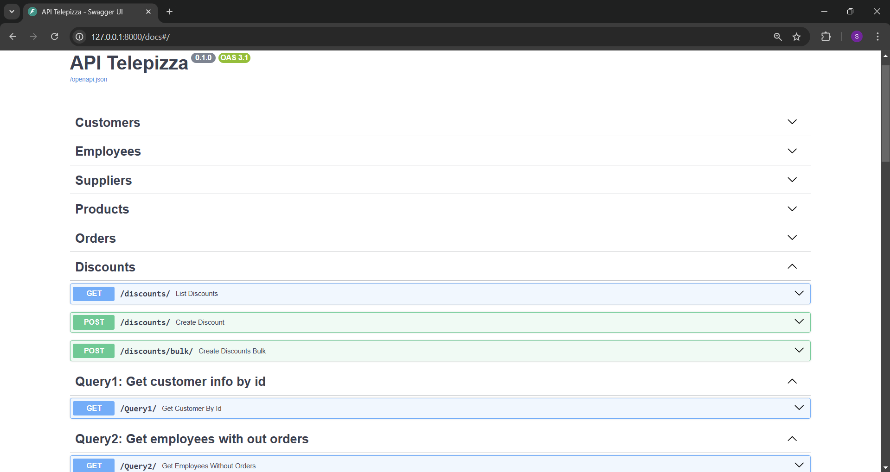

# Project: Database Management with FastAPI

This project is an implementation of **FastAPI** to manage a MySQL database. Through this API, you can perform the following operations:

- **List data**: Retrieve data from the database.
- **Create data**: Insert a new record into the database.
- **Bulk create data**: Insert multiple records at once into the database.

The goal of this project is to provide a simple solution to interact with a database using a RESTful API built with **FastAPI**.

## How It Works

### How does it work?

1. **RESTful API**:  
   The API is built with **FastAPI** and allows interaction with a MySQL database. CRUD operations are performed via HTTP routes:

   - **GET**: To list data from the database.
   - **POST**: To insert a new data record.
   - **POST (bulk)**: To insert multiple records at once.

2. **Database**:  
   It uses **MySQL** to store the data. The connection to the database is made using the **mysql-connector-python** library.

3. **Models and Validation**:  
   **Pydantic** is used to validate input and output data, while the data models are defined using **SQLAlchemy**.



### API Endpoints

- **GET** `/items/`:  
   Retrieves all records from the database.

- **POST** `/items/`:  
   Inserts a new record into the database. Example request body:
  ```json
  [
    {
      "name": "New Item",
      "description": "Item description"
    }
  ]
  ```

## Technical Instructions

### Setting Up the Environment

1. **Create and activate the Python virtual environment**

```bash
   python -m venv venv
   .\venv\Scripts\Activate
```

##

2. **Install dependencies**

```bash
    pip install -r requirements.txt
```

## License

This project is licensed under the MIT License.
